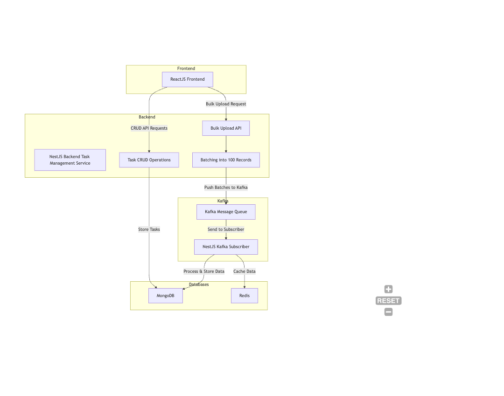

# Task Management System

This project is a **Task Management System** inspired by Jira, allowing users to manage tasks via a set of CRUD APIs. It supports bulk task creation via Excel uploads and uses CQRS design pattern in NestJS for the backend. The frontend is built with ReactJS, and Kafka is integrated for efficient bulk task processing. MongoDB is used for storage and Redis for caching.

## Features

- **CRUD Operations on Tasks**: Create, Read, Update, and Delete tasks with fields like `id`, `title`, `description`, `status`, and `deadline`.
- **Bulk Upload API**: Upload an Excel file, and multiple tasks are created in batches.
- **CQRS Pattern**: Commands and queries are handled separately for efficient processing.
- **Kafka Integration**: Bulk upload tasks are processed asynchronously in batches using Kafka.
- **MongoDB for Storage**: Tasks are persisted in MongoDB.
- **Redis for Caching**: Task data is cached in Redis to optimize performance.
- **ReactJS Frontend**: A React-based UI to display tasks and job status.

## Project Architecture

```
.
├── apps/
│   ├── web/                    # Frontend (ReactJS)
│   └── task-management-service/ # Backend (NestJS)
├── docker-compose.yml           # Docker Compose for services
└── README.md                    # Project Documentation
```

## Prerequisites

- **Docker** and **Docker Compose** installed on your system.
- **Node.js**, **npm** and **pnpm** (for local development outside Docker, optional).
  
## Setup

1. Clone the repository:

    ```bash
    git clone https://github.com/your-repo/task-management-system.git
    cd task-management-system
    ```

2. Ensure Docker and Docker Compose are installed and running.

3. Set up environment variables for both the backend and frontend by creating `.env` files in the appropriate directories:

    **Backend (`/apps/task-management-service/.env`)**:
    ```env
    MONGO_URI=mongodb://mongo:27017/tasksdb
    REDIS_HOST=redis
    KAFKA_BROKER=kafka:9092
    ```

    **Frontend (`/apps/web/.env`)**:
    ```env
    REACT_APP_API_URL=http://localhost:4000/api
    ```

## Running the Project

To run the project locally with Docker Compose:

```bash
docker-compose up --build
```

This will start the following services:

- **MongoDB** (`mongo`) - Task data storage
- **Mongo Express** (`mongoexpress`) - Web interface for MongoDB
- **Task Management Service** (`task-management-service`) - NestJS backend
- **Web Frontend** (`web`) - ReactJS frontend
- **Kafka** (`kafka`) and **Zookeeper** (`zookeeper`) - Messaging for task batch processing
- **Redis** (`redis`) - Caching layer for tasks
- **Kafka UI** (`kafka-ui`) - Web interface for Kafka monitoring

## API Documentation

The backend exposes the following APIs for managing tasks:

1. **Create Task**:
    - **Method**: `POST`
    - **URL**: `/api/tasks`
    - **Body**:
      ```json
      {
        "title": "Task Title",
        "description": "Task Description",
        "status": "Pending",
        "deadline": "2024-12-31"
      }
      ```

2. **Get Task by ID**:
    - **Method**: `GET`
    - **URL**: `/api/tasks/:id`

3. **Update Task**:
    - **Method**: `PUT`
    - **URL**: `/api/tasks/:id`
    - **Body**:
      ```json
      {
        "title": "Updated Title",
        "description": "Updated Description",
        "status": "In Progress",
        "deadline": "2024-12-31"
      }
      ```

4. **Delete Task**:
    - **Method**: `DELETE`
    - **URL**: `/api/tasks/:id`

5. **Bulk Task Upload**:
    - **Method**: `POST`
    - **URL**: `/api/tasks/upload`
    - **Body**: Multipart form-data, upload an Excel file.

## Kafka & Bulk Processing

The system processes bulk uploads using Kafka:

- The `file upload` API accepts an Excel file, splits the tasks into batches of 100, and publishes each batch as a message to Kafka.
- Kafka subscribers then consume these messages and insert the batches into MongoDB. The task data is also cached in Redis for faster retrieval.


## Frontend

The frontend is a ReactJS-based application that displays:

- **Tasks Table**: Lists all tasks from MongoDB.
- **Jobs Table**: Displays the status of bulk uploads (jobs) processed via Kafka.

Access the frontend by navigating to:

```
http://localhost:3000
```

### Logs

You can view logs for individual services using:

```bash
docker-compose logs <service-name>
```

Example:

```bash
docker-compose logs task-management-service
```

## Optional Services

You can uncomment the following services in `docker-compose.yml` if needed:

- **Elasticsearch**: For advanced search capabilities.
- **Logstash**: For managing log data.
- **Kibana**: For visualizing data from Elasticsearch.

## Bulk Operations with Kafka in Monorepo

The frontend allows users to upload an Excel file.
The NestJS backend processes the Excel data and splits it into batches of 100 records.
Each batch is then pushed to a Kafka topic for further processing.
On the backend, the same NestJS service listens (or subscribes) to the Kafka topic and processes these batches one by one.

Note: This Kafka subscription for batch processing could be handled in a separate NestJS service for better separation of concerns. However, for simplicity and ease of management, we have implemented the subscription within the same NestJS project.

### Testing

This project includes unit and integration tests written using the Jest testing framework for both React and NestJS applications.

React: Test cases cover the majority of the key components and functionality within the React frontend.
NestJS: The backend also includes Jest-based tests for many core functionalities and services.

### Flow



### Video

[Watch the demo video](./video/tasks-manager.mov)

